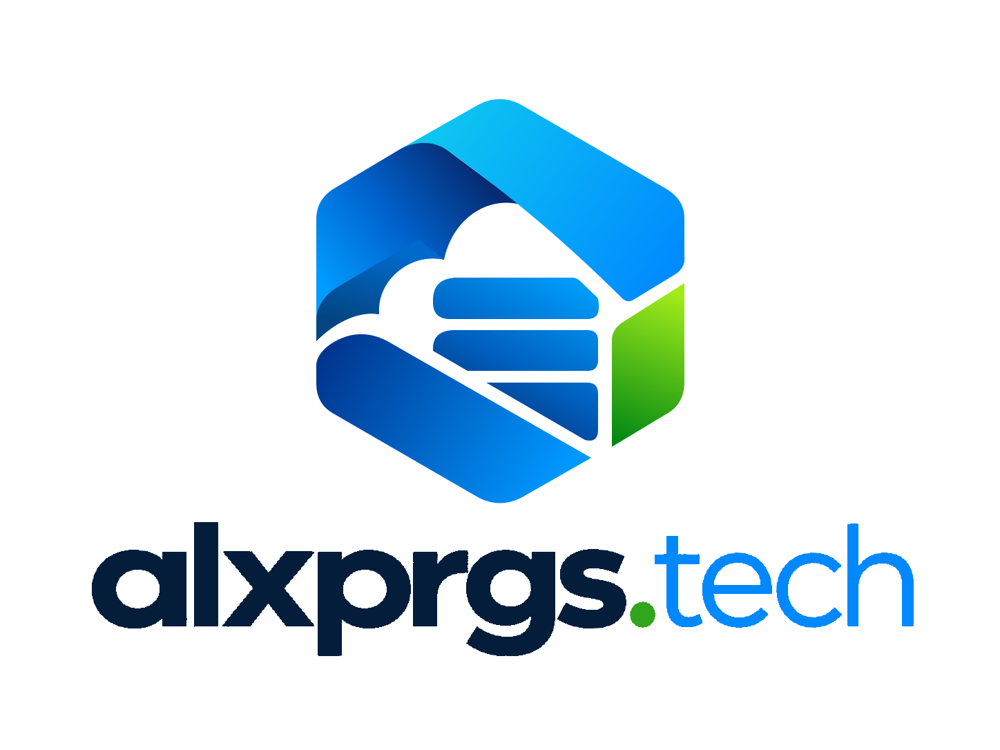

<div align="center">
<p align="center">
  
</p>

### Infrastructure · Software · Developer Tools

Building and maintaining personal infrastructure, web services, APIs,
automation tools and open-source projects.

[](https://alxprgs.tech)
[](https://github.com/alxprgstech/)

</div>

---

## About

**alxprgs.tech** is a personal technology ecosystem for developing,
deploying and maintaining software, infrastructure and experimental projects.

The organization brings together backend services, web applications,
APIs, authentication systems, automation tools and infrastructure components
under a single environment.

The main focus is on building practical systems that can be deployed,
maintained and expanded over time.

---

## Core Stack

| Area | Technologies |
|---|---|
| Backend | Python · FastAPI |
| Frontend | React · Vite · JavaScript / TypeScript |
| Infrastructure | Linux · Docker · Docker Compose |
| Cloud | AWS · Microsoft Azure |
| Networking | Cloudflare · DNS · Reverse Proxy |
| Databases | PostgreSQL · MongoDB · SQLite |
| Development | Git · GitHub · GitHub Actions |
| APIs | REST · OAuth2 · JWT · OpenAPI |

---

## Cloud Infrastructure

Infrastructure is primarily hosted on VPS and cloud services provided by:

- **Amazon Web Services**
- **Microsoft Azure**

Services are deployed using Linux-based environments, Docker containers
and automated deployment workflows.

The main domain for the ecosystem is:

### `alxprgs.tech`

It is used as the central namespace for websites, APIs, services,
development environments and infrastructure components.

Example structure:

```text
alxprgs.tech
├── api.alxprgs.tech
├── auth.alxprgs.tech
├── docs.alxprgs.tech
├── status.alxprgs.tech
└── *.alxprgs.tech
